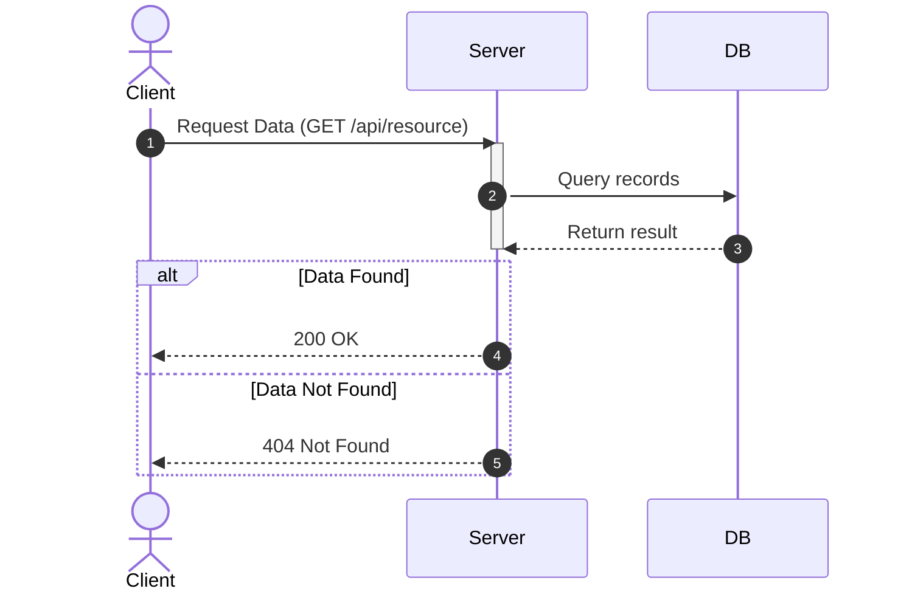

```mermaid
sequenceDiagram
    autonumber
    
    actor Client
    participant Server
    participant DB

    Client->>Server: Request Data (GET /api/resource)
    
    activate Server
    Server->>DB: Query records
    DB-->>Server: Return result
    deactivate Server

    alt Data Found
        Server-->>Client: 200 OK
    else Data Not Found
        Server-->>Client: 404 Not Found
    end
```
