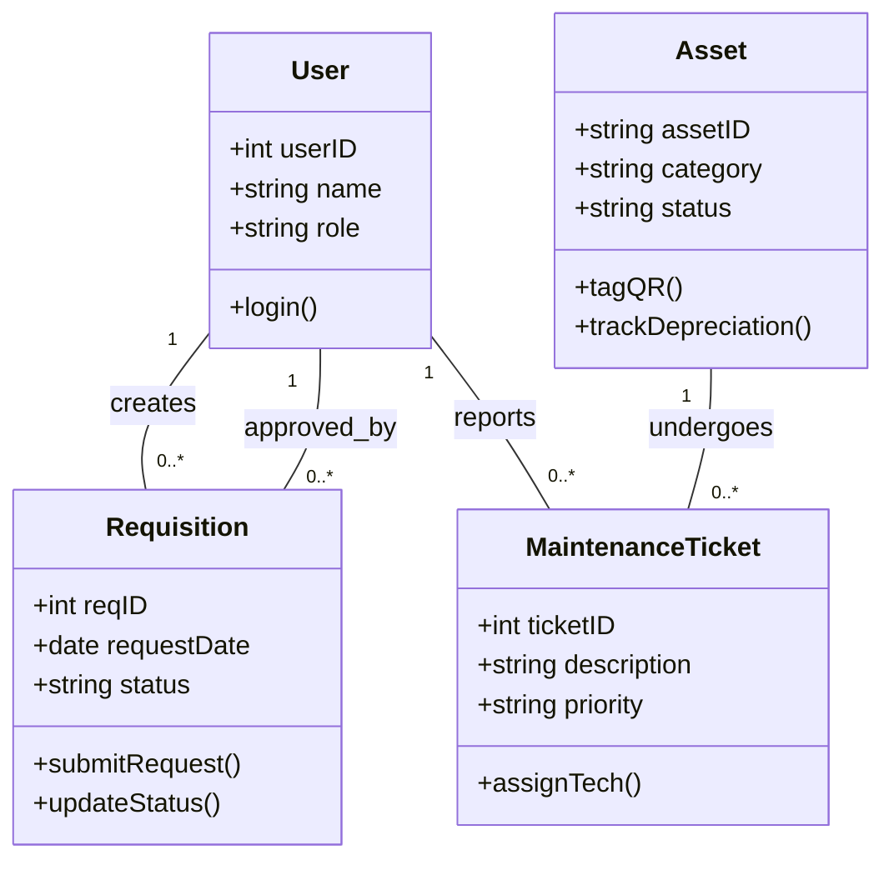
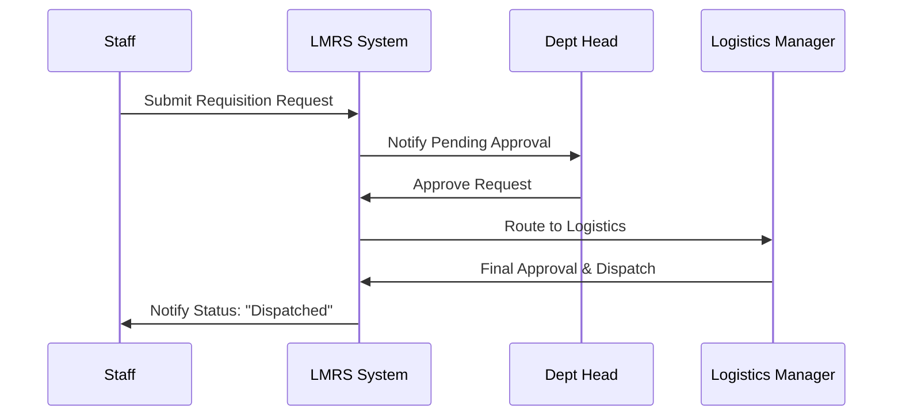
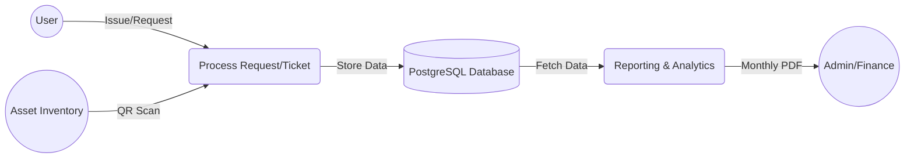
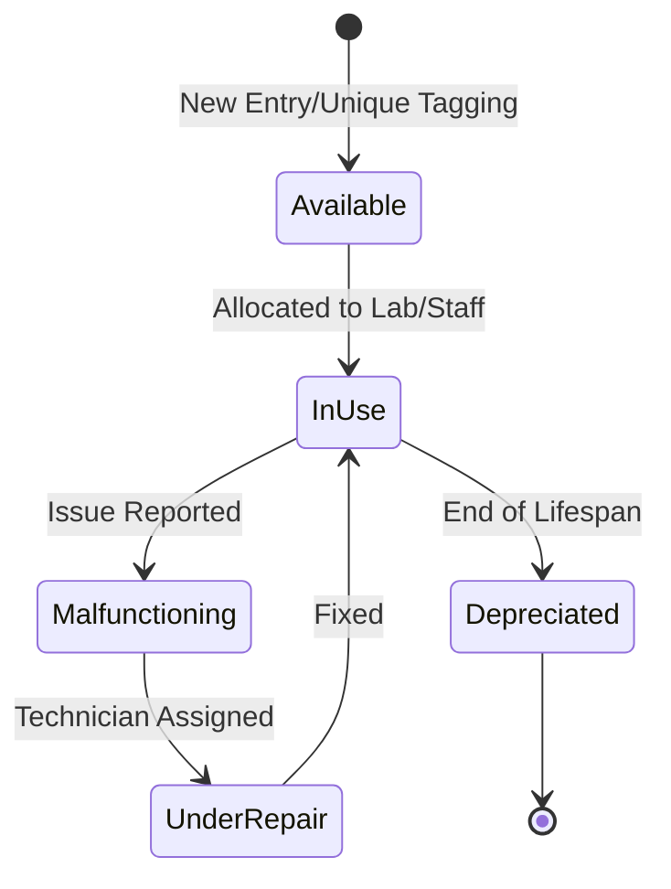

```mermaid
useCaseDiagram
    actor "Staff Member" as Staff
    actor "Department Head" as Head
    actor "Logistics Manager" as Manager
    actor "Technician" as Tech

    package "LMRS System" {
        usecase "Submit Requisition" as UC1
        usecase "Report Equipment Issue" as UC2
        usecase "Approve/Reject Request" as UC3
        usecase "Assign Maintenance Task" as UC4
        usecase "Update Asset Inventory" as UC5
        usecase "Generate Reports" as UC6
    }

    Staff --> UC1
    Staff --> UC2
    Head --> UC3
    Manager --> UC3
    Manager --> UC4
    Manager --> UC5
    Manager --> UC6
    Tech --> UC4
```







